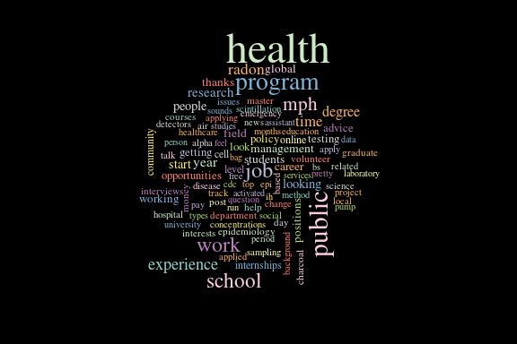
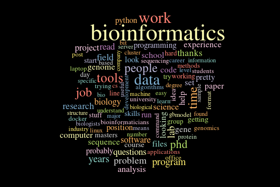
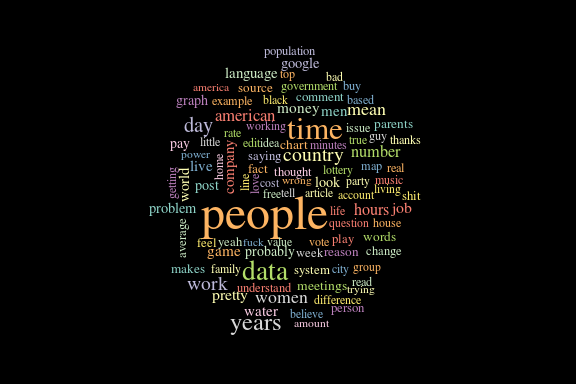
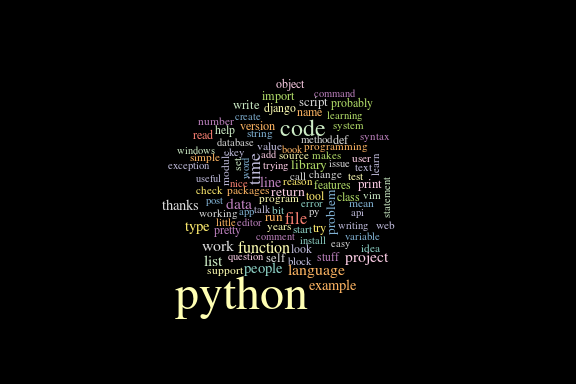
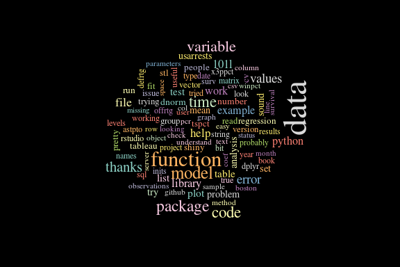

# Reddit Wordclouds with Python and R
[Brian High](https://github.com/brianhigh)  
  

## 

<a rel="license" href="http://creativecommons.org/licenses/by-sa/4.0/"></a><br />This work is licensed under a <a rel="license" href="http://creativecommons.org/licenses/by-sa/4.0/">Creative Commons Attribution-ShareAlike 4.0 International License</a>.

## Get word frequencies

To make a simple wordcloud of a Reddit forum ("subreddit"), we can use 
[reddit-analysis](https://github.com/rhiever/reddit-analysis) to generate a CSV 
of word frequencies. It uses the Reddit API to get data from the Reddit website.


```bash
# Install reddit-analysis first: https://github.com/rhiever/reddit-analysis
# Then run this from your Bash (Terminal) shell
[ -f subreddit-publichealth.csv ] || word_freqs /u/USERNAME /r/publichealth
```

## Install and load `wordcloud` package

We will install packages only if we don't already have them.


```r
for (pkg in c("wordcloud")) {
    if (! require(pkg, character.only=T)) { 
        install.packages(pkg, repos="http://cran.fhcrc.org", dependencies=TRUE)
        suppressPackageStartupMessages(library(pkg))
    }
}
```

```
## Loading required package: wordcloud
## Loading required package: RColorBrewer
```

## Wordcloud function

It is very easy to make a wordcloud from the CSV. Just import the data into a 
data.frame and run the `wordcloud` function on the word and frequency columns.

We will set a few other options with `par` and `title` to make the clouds nicer.

Wrapping this in a function will allow us to make clouds quickly and easily.


```r
wc <- function(subr){
    # Import only the first 100 rows (top 100 words)
    data <- read.table(file = paste0('subreddit-', subr, '.csv', collapse=''), 
                        header = FALSE, sep = ':', stringsAsFactors = FALSE, 
                        col.names = c("word", "freq"), nrows=100)
    
    # Use a black background and serif font
    par(bg = "black", family = "serif")
    
    # Use scale= to limit the size of the words so they will fit in the cloud
    wordcloud(data$word, data$freq, colors=brewer.pal(12, "Set3"), 
              random.color = TRUE, scale=c(3, .5))
}
```

## /r/publichealth

Try our first wordcloud.


```r
wc("publichealth")
```

 

## More, more!

How about "bioinformatics", "datascience", "dataisbeautiful", python", "rstats", 
and "learnprogramming"?


```bash
for subr in \
bioinformatics datascience dataisbeautiful python rstats learnprogramming; do \
    [ -f subreddit-$subr.csv ] || word_freqs /u/USERNAME /r/$subr
done
```

We could generate all of them at once using `sapply`, but they would all run
together. Since this is a slide presentation, let's make one per slide.


```r
res <- sapply(c("bioinformatics", "datascience", "dataisbeautiful", "python", 
                "rstats", "learnprogramming"), wc)
```

## /r/bioinformatics


```r
wc("bioinformatics")
```

 

## /r/datascience


```r
wc("datascience")
```

 

## /r/dataisbeautiful


```r
wc("dataisbeautiful")
```

 

## /r/python


```r
wc("python")
```

 

## /r/rstats


```r
wc("rstats")
```

 

## /r/learnprogramming


```r
wc("learnprogramming")
```

 
